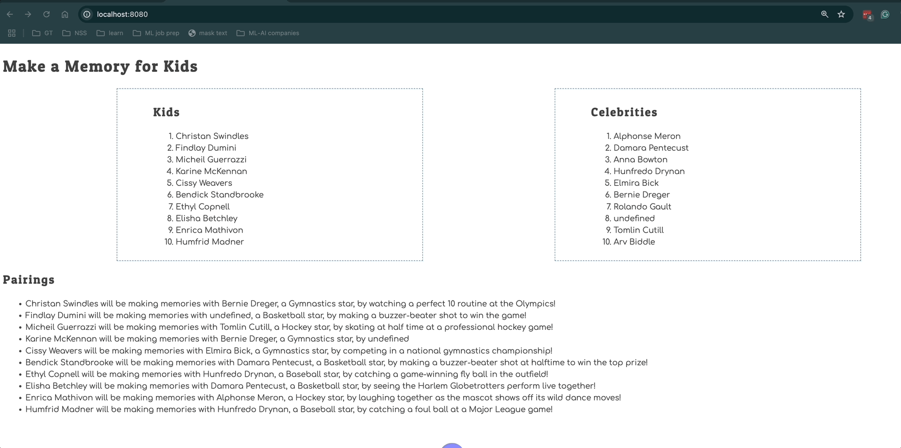

# Events and Debugging Assessment

Time to assess how well you have learned to use the debugging tools in Chrome Dev Tools, and writing click event listeners. This application is to show kids with illnesses and the memories the would like to make. Celebrities sign up to help kids make memories.

> 🧨 Make sure you answer the vocabulary and understanding questions at the end of this document before notifying your coaches that you are done with the project

## Event Listeners to Create

1. When the kid name is clicked, it should display their wish.
1. When the celebrity name is clicked, it should display their sport.
1. The pairings list should should contain the pairing in the following format.
    ```html
    {child name} will be making memories with {celebrity name}, a {celebrity sport} star, by {child wish}
    ```

Below is an animation showing how the application should look when complete and how the event listeners should work.



## Setup

Your instruction team will provide a link for you to create your assessment repository. Once your repo is created, clone it to your machine.

1. Make sure you are in your `workspace` directory.
1. `git clone {github repo SSH string}`.
1. `cd` into the directory it creates.
1. `code .` to open the project code.
1. Use the `serve` command to start the web server.
1. Open the URL provided in Chrome.

Make sure your Developer Tools are open at all times while working on this project. Use the messages provided in the Console to determine what code needs to be fixed or implemented, and use breakpoints in the Sources tab to step through your code as you debug.

## Vocabulary and Understanding

Before you click the "Complete Assessment" button on the Learning Platform, add your answers below each question and make a commit.

1. When a child is clicked on in the browser, which module contains the code that will execute on that event happening? Can you explain the algorithm of that logic?
   > The Kids.js module executes the code that makes the event happen since it contains the event listener function causing the window alert when a child's name is clicked. It exists in this module since Kids.js only contains code that utilizes the children array of objects from the database. The click event in this module starts when there is a mouse click on the page, and it determines if the click event occurred on a dataset with a "child" type. If so, it will loop through each child object to see if the id in the child li item matches the child id in each child object. If the id's match, the window alert is created to list the child's name and their wish.
2. In the **Pairings** module, why must the `findCelebrityMatch()` function be invoked inside the `for..of` loop that iterates the kids array?
   > Invoking findCelebrityMatch() in another function allows each function in the module to perform only one task. The purpose of the findCelebrityMatch() function is to loop through each celebrity object in the celebrityArray to find which kidObject has a celebrityId property that matches the celebrity id. This function is invoked in the  `for...of` loop iterating the kids array because this way, each individual kid object can be used as an argument for the kidObject property more efficiently in the findCelebrityMatch function, while still receiving the `celebrities` array as an argument for its second parameter. 
3. In the **CelebrityList** module, can you describe how the name of the sport that the celebrity plays can be displayed in the window alert text?
   > Since each celebrity object in the celebrities array is being iterated to determine if the id property matches the celebrityId in the selected li, we will have all the properties for the matching celebrity object to pull from in the window alert. Since one of the properties lists the sport the celebrity plays, we can interpolate this using ${celebrity.sport} in the string to display the name of the sport in the alert.
4. Can you describe, in detail, the algorithm that is in the `main` module?
   > The main.js module is using the functions exported from the Kids.js, CelebrityList.js, and Pairings.js modules to render an HTML string to the DOM. It begins by importing the functions from these modules, and declaring a variable to store the element (the `container` id) we will be rendering HTML to. Then, the HTML string to be rendered is stored in the applicationHTML variable. The HTML string lists the main header and each section of the webpage, with the imported functions being invoked in their respective sections or article so their HTML strings will also be visible on the DOM. Finally, the HTML string is rendered to the DOM by equating it to the element with the `container` id and adding the innerHTML property to the mainContainer variable. 
